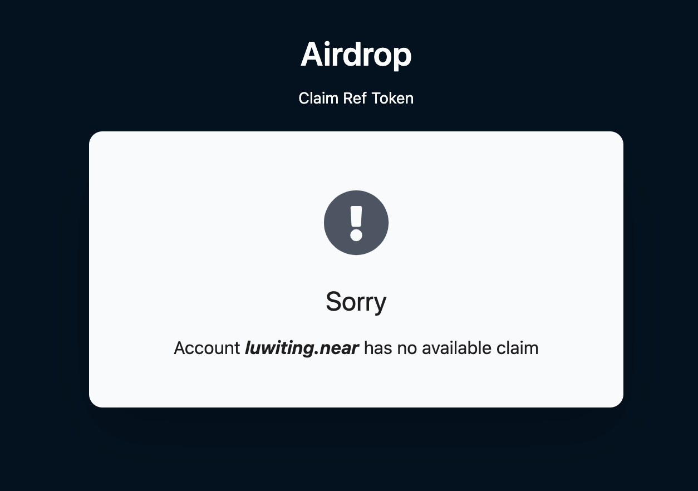
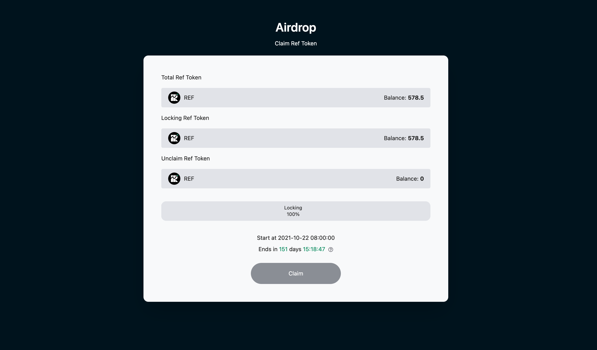

# Airdrop Round 1

Early, active users of Ref Finance will receive an airdrop of 3% of the total supply. These tokens will be locked for a total of 6 months. The first 50% will unlock after 3 months, with an additional 50% unlocking after 6 months.

Prior to the sale, we will post the full airdrop recipient list, along with instructions for claiming your airdrop!

## Airdrop Intro

#### Airdrop Rules

**airdrop round 1 token supply: 1 million REF**

_3% of the planned token supply \(3 million REF\) will be airdropped to early active users._

#### Whitelist eligibility requirements

Have an account on Ref.finance and take one of the following actions by July 22, 2021

1. provided liquidity to any pool 3 or more times
2. exchanged 7 or more times on the platform

#### Airdrop Token Allocation Model

Token allocation will be split 30-70 between LPs and traders. this means 30% of tokens will be split evenly between 757 liquidity providers and 70% will be split evenly between 3844 traders.

LP awarded REF = 300,000/757 LP = 182.1REF

Traders awarded REF = 700,000 / 3,844 traders = 396.4REF

#### Linear Unlocking Arrangement

The lock will be maintained for 3 months from July 22 \(until October 22\) and then will be unlocked linearly within 1 month.

#### Collection Period

This event will be open for pickup from the unlock date of October 22 at 0:00 UTC - January 22.

For this drop, drop recipients will be able to claim their full REF allocation for the first 2 months after the drop allocation is completed. If the user does not take any action, unclaimed airdrop tokens will be transferred back to the DAO vault.

## Receiving steps

**Please confirm whether you are qualified in the list.Click here.**

User pages that are not in the whitelist

Within the next few weeks, your claimable airdrop balance will appear under your "Account" section.

