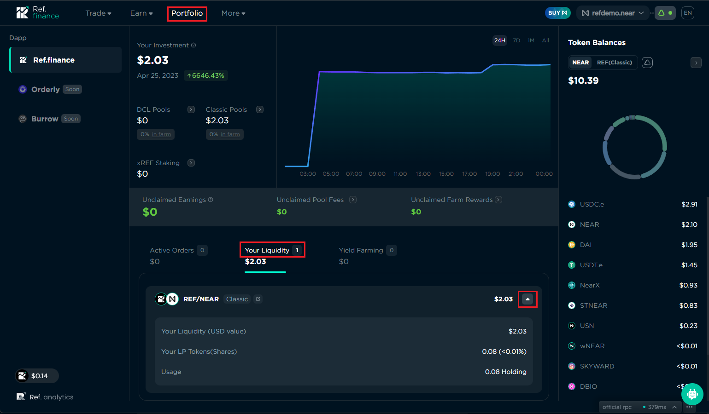

# Pooling

Ref Finance offers [several types of Liquidity Pools](../overview.md), Classic, Stable, Rated, and DCL. Classic pools are based on the Uniswap v2 algorithm; Stable pools, which can contain two or more tokens, use Curve's StableSwap algorithm; Rated pools are for yield-bearing tokens, and are based on a variation of Curve's StableSwap algorithm; and [Ref v2's "DCL" Pools](../guides/add-liquidity/ref-v2-pools.md), which are based on [iZUMi Finance’s Discretized Liquidity AMM](#user-content-fn-1)[^1].

Classic pools are fully permissionless, meaning that anyone can create a Classic pool, and set the fee for that pool. Currently only [Guardians](../../developers/guardians.md) can create Stable, Rated, and DCL pools.

## Trading Fees

Trades that take place using liquidity from a pool are charged a fee. The fee is defined at the creation of the pool, and cannot be modified once the pool is created. The pool fee usually varies from 0.05% to 0.3%.&#x20;

Users can earn a share of the trading fees by depositing tokens into the pool (also known as "adding liquidity"). When a trade is made, the share of the trading fees a liquidity provider receives is directly proportional to their share of the liquidity in the pool used for that trade. A user who has 1% of the total liquidity will receive 1% of the trading fees designated for liquidity providers.&#x20;

## Pool Tokens&#x20;

When a user adds liquidity to a pool, they will receive one or more tokens representing their share of the pool. Shares of Classic, Stable, and Rated pools are represented by LP Tokens (LPT). LPTs are fungible tokens where the quantity held is equal to the amount of shares of the pool (e.g. 1 LPT token = 1 pool share, and 0.25 LPTs = 0.25 pool shares). On the other hand, shares of DCL pools are represented by non-fungible tokens (NFT). When a user adds liquidity to a DCL pool, they will receive **one** NFT containing the details of their position, including the number of shares it is worth. In other words, a DCL NFT can be worth 1 pool share, or 0.25 pool shares. Users can hold multiple NFTs for the same DCL pool, each of which will represent a position in that pool.

## Pool APR

Pool APR is the yield you accrue by adding liquidity to a pool. You earn 80% of the pool fee for all trades on the associated pair (or triple for stablecoin pool) proportional to your share of the pool.&#x20;

 (2).jpg>)


For Classic pools, if there is no account to receive the Referral Fee, it goes to all LPs of that pool as a form of increased LP tokens. For the other types of pools, it goes to the Protocol Fee as a form of increased LP tokens


Fees are added to the pool, accrue in real-time, and can be claimed when you withdraw your Liquidity.


Your share will be accrued in real-time and will be paid in addition to your existing position when you remove liquidity from the pool


## Viewing liquidity position(s)

There are two locations where users can see their liquidity positions, the Your Liquidity page, and the Portfolio page.&#x20;

### The "Your Liquidity" page

You can see all pools you have liquidity in by going to the Your Liquidity page. You can get to the Your Liquidity page by clicking Earn > Your Liquidity in the main menu of the site.&#x20;

You can see details like how many shares you have, the USD value of your shares, and the amount of each token your shares are worth. There are also buttons to add more liquidity and remove liquidity from the pool.

<figure><figcaption></figcaption></figure>

### The Portfolio page

The "Your Liquidity" tab of the Portfolio page shows you your current liquidity positions. You can get to the Portfolio page by clicking "Portfolio" on the main menu. Each item has a drop-down icon that, when clicked, will reveal details about the position.

<figure><figcaption></figcaption></figure>

## Risks

Providing liquidity is not without risk, as you may be exposed to _Divergence Loss_ or _Impermanent Loss (IL)._

> Simply put, impermanent loss is the difference between holding tokens in an AMM and holding them in your wallet. - [Beginner’s Guide to (Getting Rekt by) Impermanent Loss](https://blog.bancor.network/beginners-guide-to-getting-rekt-by-impermanent-loss-7c9510cb2f22), Nate Hindman, 2020

[^1]: [https://izumi.finance/paper/dswap.pdf](https://izumi.finance/paper/dswap.pdf)
