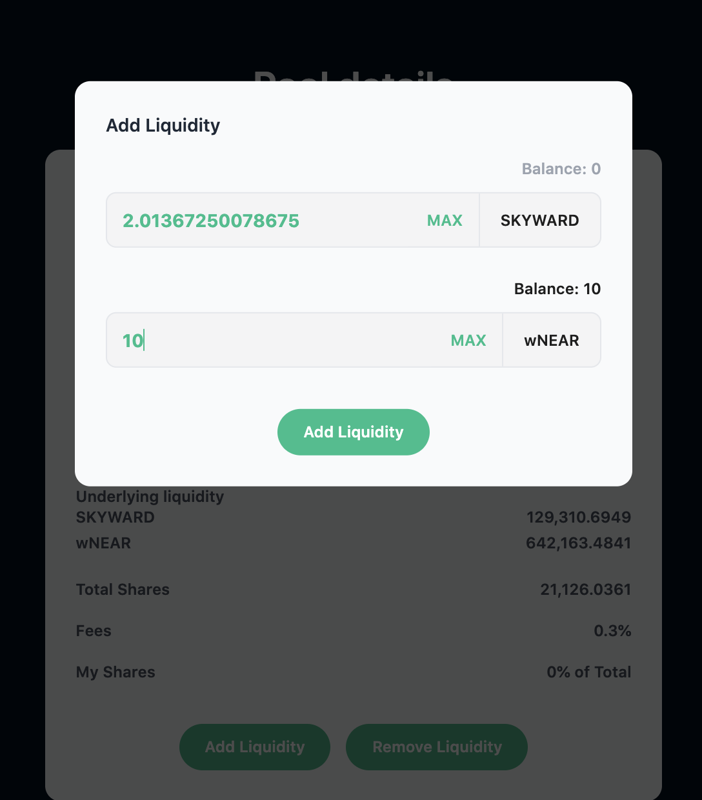
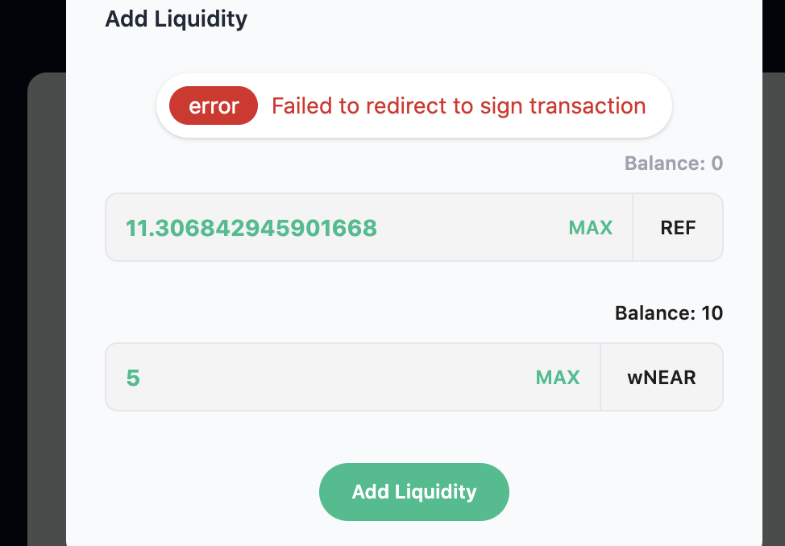
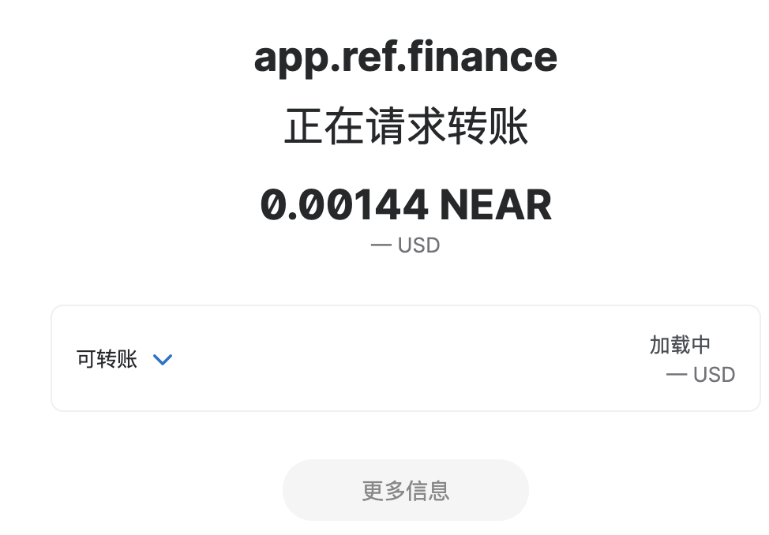
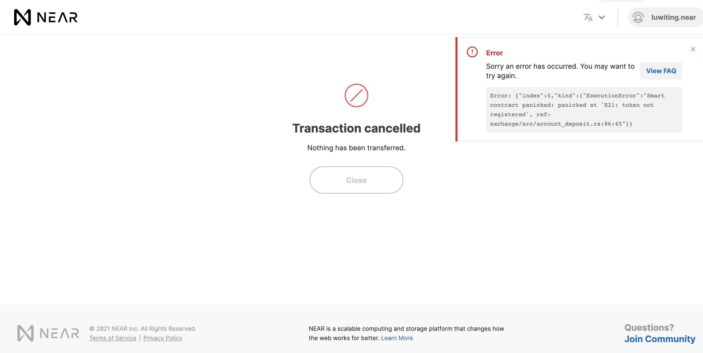

# Pools

## Add Liquidity

Step 1：Open Ref Finance Pools.

Step 2：Find the pool you want to add tokens, you can try the search bar function as it will make your process easier.

Step 3： After choosing the suitable pool, click on “Add Liquidity”.

Step 4：Enter the number you want.

Step 5：Select “Add Liquidity”, and you are finished!

#### Note：

If the balance of one of the token pairs is insufficient, an error reporting interface will appear.

The text prompt 'failed to redirect to sign transaction' pops up.

Then the interface directly skips to the near account transfer.

‘Transaction cancelled' displayed.

## Find your Liquidity Token 

Step 1：Select pools.

step 2：Choose Your Liquidity, and here you go.

## Remove Liquidity 

**There are 2 ways where you can remove your liquidity:**

Step 1：Select Pools → View Pools and choose the pool you want to remove liquidity. Then select Remove liquidity.

Step 2：Select Pools → View liquidity → Remove.

