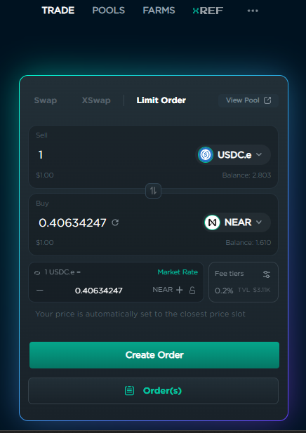
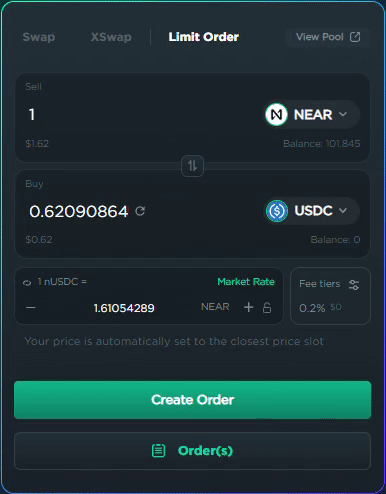
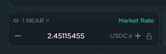
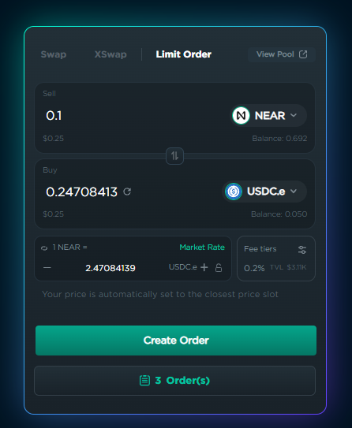
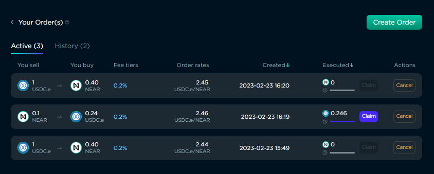

# Limit Orders

### Introduction

In addition to the improvements that [Discretized Concentrated Liquidity](../add-liquidity/ref-v2-pools.md) (DCL) brings, Ref v2 also includes a built-in limit order functionality, that allows for a Centralised Exchange-like trading experience. Consequently, this means that a limit order can only be placed when a DCL pool exists containing both the "buy" and "sell" tokens.  &#x20;

### Creating Limit Orders

To create a limit order, go to the Limit Order tab on the Trade page, and select the tokens you are going to use for the order. The "sell" token is the one in your wallet that you are going to trade for the "buy" token.&#x20;

<figure><figcaption>
Limit orders can be created on the Limit Order tab of the Trade page.
</figcaption></figure>

When creating a limit order, you must choose a swap rate that has a corresponding bin within the DCL pool (see [Pooling - DCL Pools](../add-liquidity/ref-v2-pools.md) for more info). This is not a real issue, because the difference separating one bin from the next is very small, and if you enter a rate that does not have a corresponding bin, the site will automatically change it to the closest rate that does.

<figure><figcaption>
There is no bin with a rate of 1.6, so the site selects the next closest bin
</figcaption></figure>

Clicking "Market Rate" sets the price to the bin closest to the current market rate. Use the "+" and "-" buttons to change the rate to the next or previous bin. Clicking the "loop" icon to the left of the token name changes whether the price is based on the "buy" token or "sell" token. When the lock is enabled, changing the quantity of the "buy" token will change the quantity of the "sell" token so that it matches the rate. When it is unlocked, changing the "buy" amount will keep the "sell" amount the same, and alter the price to reflect the quantities desired.&#x20;

<figure><figcaption>
Controls available for setting the price of a limit order.
</figcaption></figure>

Click the "Create Order" button when you are done setting the quantities and price for your order.

### Viewing Limit Orders

You can view your current and previous limit orders by clicking "Order(s)" at the bottom of the Limit Order tab.&#x20;

<figure><figcaption>
The "Order(s) button is showing that there are 3 active or unclaimed orders.
</figcaption></figure>

The Orders page has an "Active" and "History" tab. Active orders are ones that have not been filled, have been partially filled, or have been fully filled but have not been "Claimed". Partially filled orders can be identified by the fact that both their Claim and Cancel buttons are enabled.

<figure><figcaption>
The second order is partially filled, since the Claim button and Cancel buttons are both enabled.
</figcaption></figure>

### Canceling Orders

Unfilled orders can be canceled, as well as the unsold portion of partially filled orders. There is no fee or penalty for canceling an order. When an order is canceled, the unsold tokens are returned to your wallet. Canceling a partially filled order will transfer the purchased tokens to your wallet, cancel the unfilled portion of your order, and return the unsold tokens back to your wallet. &#x20;

### Claiming Orders

Once an order has been filled, you need to "Claim" it to transfer the purchased tokens to your wallet. There is no time limit on when you can claim an order once it has been filled.&#x20;

Clicking "Claim" on a partially filled order will transfer the tokens that have been purchased to your wallet, but will not cancel the unfilled portion of the order, so that it may eventually be filled.&#x20;
