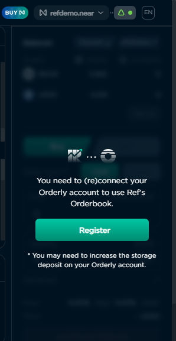
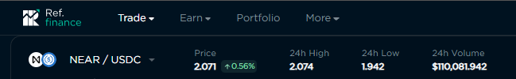
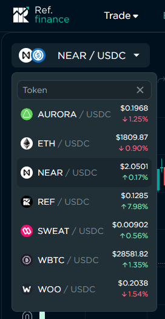
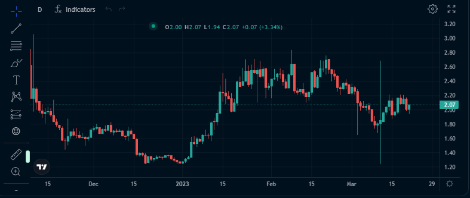
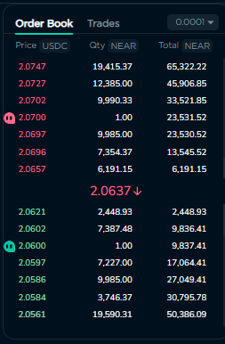
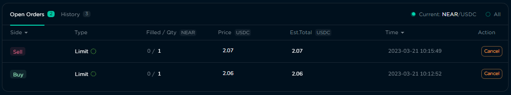
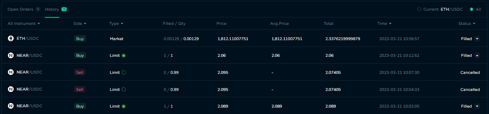

# Orderbook

## Risks & Security

The Orderbook page is a graphical user interface for trading on Orderly Network, and is provided as a convenience to users of Ref Finance. Orderly Network is fully responsible for the security of their systems, smart contracts, and any funds deposited or sent to those systems and contracts. Users are strongly encouraged to do their own research before connecting their wallet and/or placing any orders. Learn more about [Orderly Network](https://orderly.network/).

## Getting there

The page can be accessed through the Trade menu at the top of the Ref site, and you can choose Spot or Perpetual according to what you want to trade.

<figure><figcaption>
Trade menu with link to the Orderbook page.
</figcaption></figure>

## Connecting & Registering Your Wallet

In order to trade on the Orderbook, your wallet must be connected to Ref Finance, and registered with Orderly. You can do this by clicking the “Register” button located on the right side of the Orderbook page.

<figure><figcaption>
Register a wallet with Orderly.
</figcaption></figure>

## The Interface

The Orderbook’s interface is much like one that you would find on centralised exchanges. It consists of five sections, each of which is described below. &#x20;

<figure><figcaption>
The Orderbook's graphical user interface.
</figcaption></figure>

### Token Selector & 24-Hour Stats

The panel at the upper-left of the page has a select box where you choose the tokens to buy/sell. It also shows the current price of the selected token, and info about it for the last 24 hours.

<figure><figcaption>
Panel with the Token Selector and 24-Hour Stats. 
</figcaption></figure>

<figure><figcaption>
Selecting a Trading Pair
</figcaption></figure>

### Trading Chart

The bulk of the Orderbook interface is taken up by the Trading Chart. This is a candlestick chart,  showing changes in the price of the selected token over a period of time. You can change the time unit for the chart, customise its appearance, add indicators and graphical elements. Hovering your mouse over an area of the chart will show the OHLC (open, high, low, and close) prices of the token for that period in time.

<figure><figcaption>
Trading Chart
</figcaption></figure>

### Order Book

To the right of the Trading Chart is the Order Book. These contain current, or open, buy (green) and sell (red) orders placed by traders. You can see the prices being offered, the quantity of tokens at each price, as well as a running sum of those quantities. If you have any open orders, the Order Book will place a “quote” icon next to the price matching those orders.

<figure><figcaption>
Order Book with "quote" icons next to prices for open orders.
</figcaption></figure>

### Open Orders & History

The bottom of the Orderbook page is where you can see any open, or unfulfilled orders that you have, as well as orders that you have placed in the past that have been executed, or cancelled.

<figure><figcaption>
Open orders
</figcaption></figure>

By default, the panel only lists your orders for the currently selected token. You can use the control in the upper right corner of the panel to view orders for all tokens associated with your account.

<figure><figcaption>
Order history
</figcaption></figure>

### Wallet/Account Balances and Order Form

The far right-hand side of the Orderbook page contains the panels showing the amount of tokens in your wallet and Orderly account, buttons to deposit and withdraw tokens to/from your Orderly account, and the form to place buy and sell orders. You will find detailed information about these panels below.

<figure><figcaption>
Panel showing token balances and the order form. 
</figcaption></figure>

