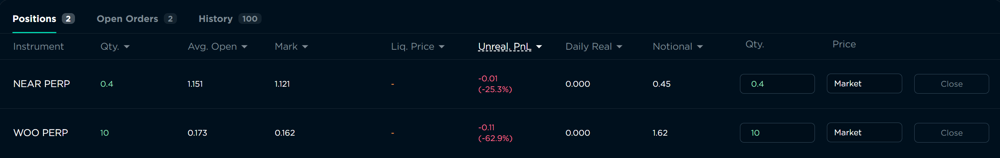
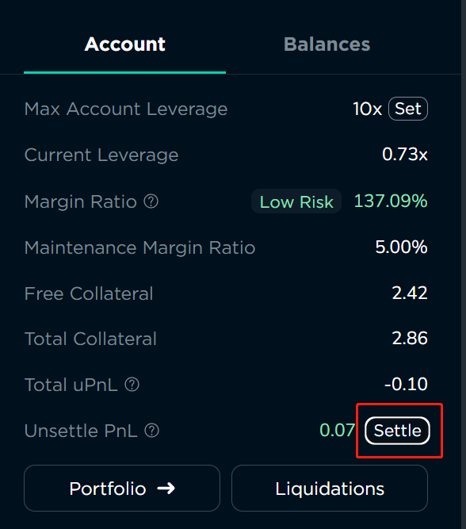
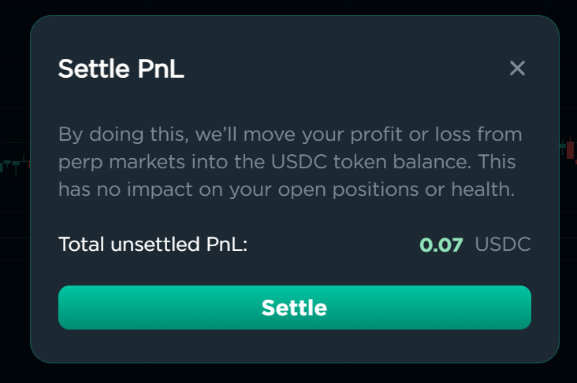

# Perpetual Futures

Ref Orderbook Perpetual is built on Orderly. You can find relevant information about Orderly Perps [here](https://docs.orderly.network/trade-on-orderly/perpetual-futures)**.** [**It is highly recommended that you read it before engaging in any transactions.** ](https://docs.orderly.network/trade-on-orderly/perpetual-futures)

**Perpetuals involve leverage. Please be cautious and aware of the associated risks.**

Most of the trading processes are similar to spot trading. You can refer [here](spot.md) for relevant information.

## View Account Information

In the upper right corner of the screen, you can view your account information.&#x20;

<figure><figcaption>
Account Information
</figcaption></figure>

Account information includes max account leverage, current leverage, margin ratio,  maintenance margin ratio, free collater, total collateral, total unrealized PnL (Profit and Loss), and unsettled PnL.

By clicing on "Portfolio", you can view your portfolio on Orderly.

By clicking on "Liquidations," you can access information about liquidation events related to your account.

## Adjust Max Account Leverage&#x20;

Perps  currently offers only cross-margin mode. You can adjust the max account leverage in account information.

In addition to affecting your buying power, the max account leverage will also impact the margin ratio and maintenance margin ratio displayed in your account.

<figure><figcaption>
 1x, 2x, 3x, 4x, 5x and 10x
</figcaption></figure>

## Manage Your Positions

In the "Positions" section, you can view all your current open positions.&#x20;

<figure><figcaption>
View your positions
</figcaption></figure>

When you are ready to close a position, you can either place an order that is opposite to your current position just as opening positions  or directly click on "Close" in the "Positions" section to initiate the closing process. When closing positions using the "Close" button, you can adjust the position size you wish to close and choose between a market order or setting a limit order.

<figure><figcaption>
Close your position by clicking "Close".
</figcaption></figure>

<figure><figcaption>
Confirm your closing order.
</figcaption></figure>

Please note that after closing a position, the realized profit and loss won't automatically be transferred to your spot trading account. You need to settle your profit and loss so that they are reflected in your balance.&#x20;

There are two ways to settle your profit and loss.

1. Navigate to "Orderly Portfolio" -> "Assets" -> "Futures" to settle.&#x20;

<figure><figcaption>
Settle PnL in Orderly Portfolio.
</figcaption></figure>

2. Click the 'Settle' button in 'Account Information'.

<figure><figcaption>
Settle PnL in Account Information.
</figcaption></figure>

 

<figure><figcaption>
Confirm the settlement.
</figcaption></figure>

