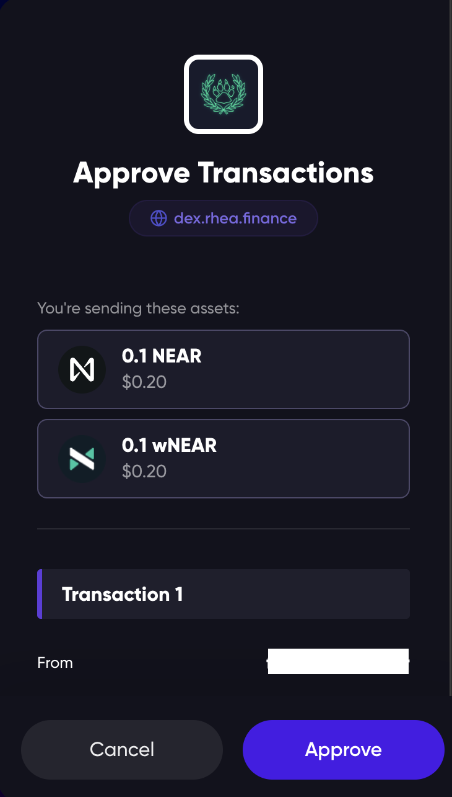

# Swap

## To start trading on the Lite version:

Make sure you are connected to RHEA Finance with your wallet.

### Step 1: Select the pair you want to swap, such as NEAR to DAI.

<figure><figcaption></figcaption></figure>

### Step 2: Review and adjust your Transaction Settings if necessary.

<figure><figcaption></figcaption></figure>

### Step 3: Click on Details and verify the transaction elements.

<figure><figcaption></figcaption></figure>

### Step 4: Initiate the swap & approve the transaction (i.e. using NEAR wallet).

