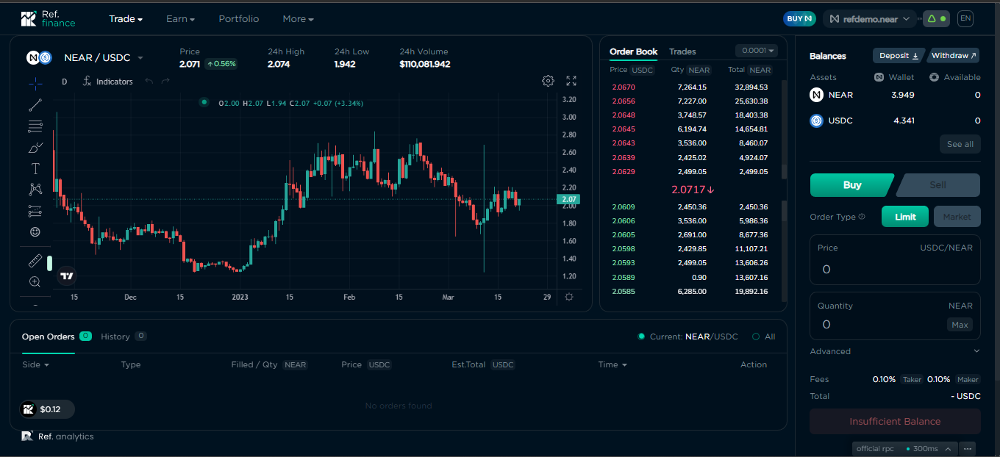
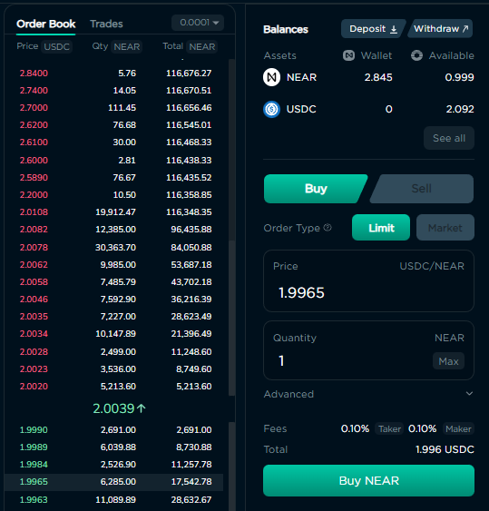
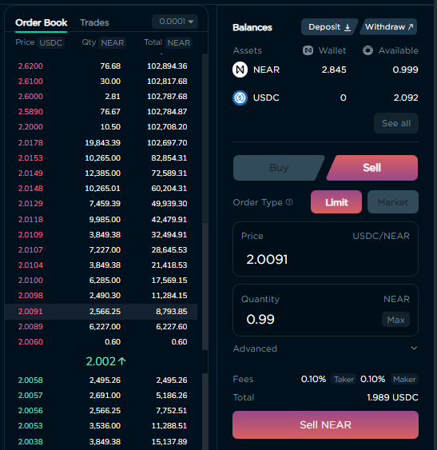
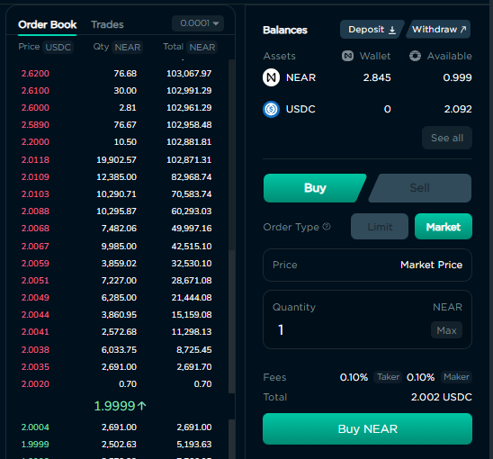
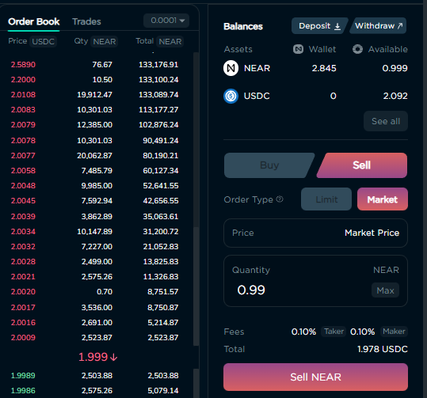

# Orderbook

## Risks & Security

The Orderbook page is a graphical user interface for trading on Orderly Network, and is provided as a convenience to users of Ref Finance. Orderly Network is fully responsible for the security of their systems, smart contracts, and any funds deposited or sent to those systems and contracts. Users are strongly encouraged to do their own research before connecting their wallet and/or placing any orders. Learn more about [Orderly Network](https://orderly.network/).

## Getting there

The page can be accessed through the Trade menu at the top of the Ref site.

<figure><figcaption>
Trade menu with link to the Orderbook page.
</figcaption></figure>

## Connecting & Registering Your Wallet

In order to trade on the Order Book, your wallet must be connected to Ref Finance, and registered with Orderly. You can do this by clicking the “Register” button located on the right side of the Orderbook page.

<figure><figcaption>
Register a wallet with Orderly.
</figcaption></figure>

## The Interface

The Orderbook’s interface is much like one that you would find on centralised exchanges. It consists of five sections, each of which is described below. &#x20;

<figure><figcaption>
The Orderbook's graphical user interface.
</figcaption></figure>

### Token Selector & 24-Hour Stats

The panel at the upper-left of the page has a select box where you choose the tokens to buy/sell. It also shows the current price of the selected token, and info about it for the last 24 hours.

<figure><figcaption>
Panel with the Token Selector and 24-Hour Stats. 
</figcaption></figure>

<figure><figcaption>
Selecting a Trading Pair
</figcaption></figure>

## Trading Chart

The bulk of the Orderbook interface is taken up by the Trading Chart. This is a candlestick chart,  showing changes in the price of the selected token over a period of time. You can change the time unit for the chart, customise its appearance, add indicators and graphical elements. Hovering your mouse over an area of the chart will show the OHLC (open, high, low, and close) prices of the token for that period in time.

<figure><figcaption>
Trading Chart
</figcaption></figure>

### Order Book

To the right of the Trading Chart is the Order Book. These contain current, or open, buy (green) and sell (red) orders placed by traders. You can see the prices being offered, the quantity of tokens at each price, as well as a running sum of those quantities. If you have any open orders, the Order Book will place a “quote” icon next to the price matching those orders.

<figure><figcaption>
Order Book with "quote" icons next to prices for open orders.
</figcaption></figure>

### Open Orders & History

The bottom of the Orderbook page is where you can see any open, or unfulfilled orders that you have, as well as orders that you have placed in the past that have been executed, or cancelled.

<figure><figcaption>
Open orders
</figcaption></figure>

By default, the panel only lists your orders for the currently selected token. You can use the control in the upper right corner of the panel to view orders for all tokens associated with your account.

<figure><figcaption>
Order history
</figcaption></figure>

### Wallet/Account Balances and Order Form

The far right-hand side of the Orderbook page contains the panels showing the amount of tokens in your wallet and Orderly account, buttons to deposit and withdraw tokens to/from your Orderly account, and the form to place buy and sell orders. You will find detailed information about these panels below.

<figure><figcaption>
Panel showing token balances and the order form. 
</figcaption></figure>

### How to use the Orderbook

### Depositing & Withdrawing Tokens

Any token you wish to sell, or use to buy another token, must first be deposited into your Orderly account. This can be achieved by clicking the Deposit or Withdraw buttons in the panel located in the upper-right corner of the Orderbook page.

<figure><figcaption>
Closeup showing token balances, and Deposit/Withdraw buttons. 
</figcaption></figure>

Along with the Deposit and Withdraw buttons, the panel shows the amounts for the tokens of the selected trading pair that are in your Near wallet and Orderly account. Clicking the “See all” button will open a window showing the balances for all tokens capable of being traded on Orderly.

<figure><figcaption>
Account balance for all tokens that can be traded on the Orderbook.
</figcaption></figure>

Clicking the Deposit or Withdraw button will open a form that allows you to perform that particular action. Each form allows you to select the token you wish to deposit or withdraw, and the amount as a number or percentage.

<figure><figcaption>
Deposit token form.
</figcaption></figure>

 

<figure><figcaption>
Withdraw token form.
</figcaption></figure>

### Placing Orders

Any token you wish to sell, or use for a Buy order, must first be deposited into your Orderly account. Please see [Depositing & Withdrawing Tokens](orderbook.md#depositing-and-withdrawing-tokens) for more information.

The far right of the Orderbook page contains the panel that allows you to place an order to buy or sell the currently selected token. There are two types of orders that you can place, Limit and Market.

<figure><figcaption>
Token balances and order form.
</figcaption></figure>

#### Limit Orders

A Limit Order is an order to buy or sell at a specific price, or better. Limit orders are not guaranteed to execute. When there are tokens available at the order’s price, the order will be executed. If the amount available at that price is less than the total quantity set for the order, then the order will be partially executed. The unfilled portion of the order will remain open, until such time that more tokens become available at the specified price, or you cancel the order. When a partially filled order is cancelled, only the unfilled amount will be returned to your Orderly account.

To place a Limit Order, make sure “Limit” is selected as the Order Type, enter the price at which you want the order to execute, the quantity you wish to buy or sell, and click the Buy/Sell button at the bottom of the panel. Clicking a row on the Order Book will set the price of your order to the price of the row you clicked.

<figure><figcaption>
Limit order to buy NEAR
</figcaption></figure>

 

<figure><figcaption>
Limit order to sell NEAR
</figcaption></figure>

#### Market Orders

A Market Order is matched to the best available market price at the time the order is placed, and is immediately executed.

To place a Market Order, choose “Market” as the Order Type, and enter the quantity you wish to buy or sell.

<figure><figcaption>
Market order to buy NEAR.
</figcaption></figure>

 

<figure><figcaption>
Market order to sell NEAR.
</figcaption></figure>

### Cancelling Orders

The bottom panel allows you to cancel any open orders. If an order has been partially filled, then only the unfilled portion will be cancelled.

<figure><figcaption>
Open orders capable of being cancelled 
</figcaption></figure>
