# Stable & Rated Pools

## How to add liquidity to a Stable or Rated Pool

### 1. Go to the Stable Pools tab on the Liquidity Pools page

The Liquidity Pools page can be found in the top menu under "Earn"

<figure>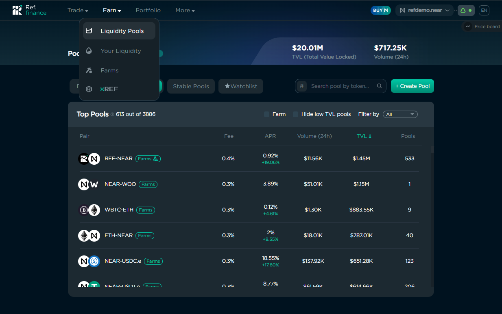<figcaption></figcaption></figure>

Make sure you are on the "Stable Pools" tab.&#x20;

<figure>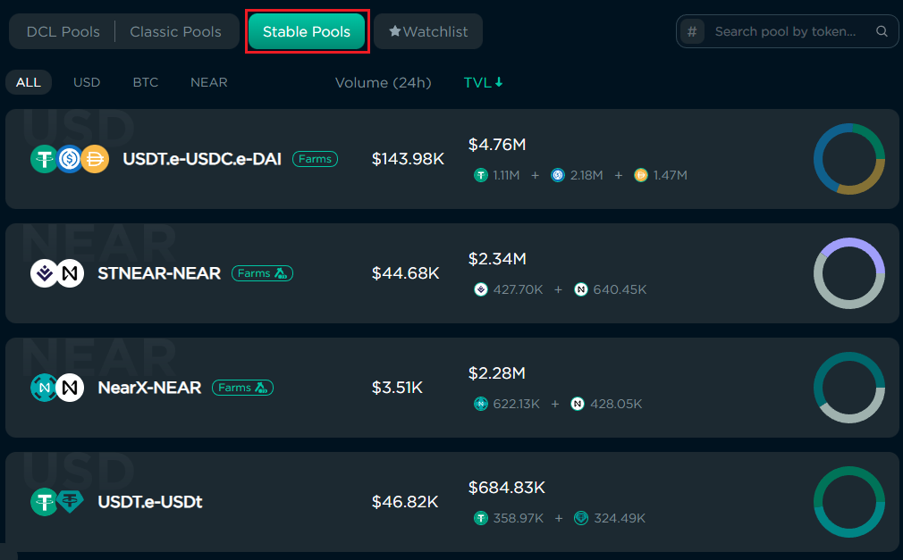<figcaption></figcaption></figure>

### 2. Locate a specific pool

There's a search box to filter pools by token, and sub-tabs to filter by type of pool.&#x20;

<figure>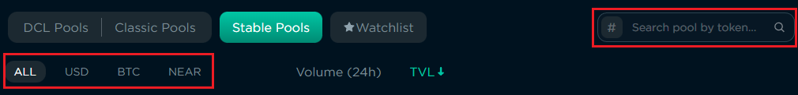<figcaption></figcaption></figure>

"USD" pools are stable pools where all tokens are pegged to the US dollar. BTC are pools where both tokens are pegged to Bitcoin. "NEAR" are Rated pools where one of the tokens is wNEAR, and the second is a a yield-bearing, or "liquid staking", token like STNEAR, NEARX, and LINEAR.

Incentivized pools have a "Farms" tag next to their token pairs, and those with multiple reward tokens will include a special icon within the tag.&#x20;

<figure>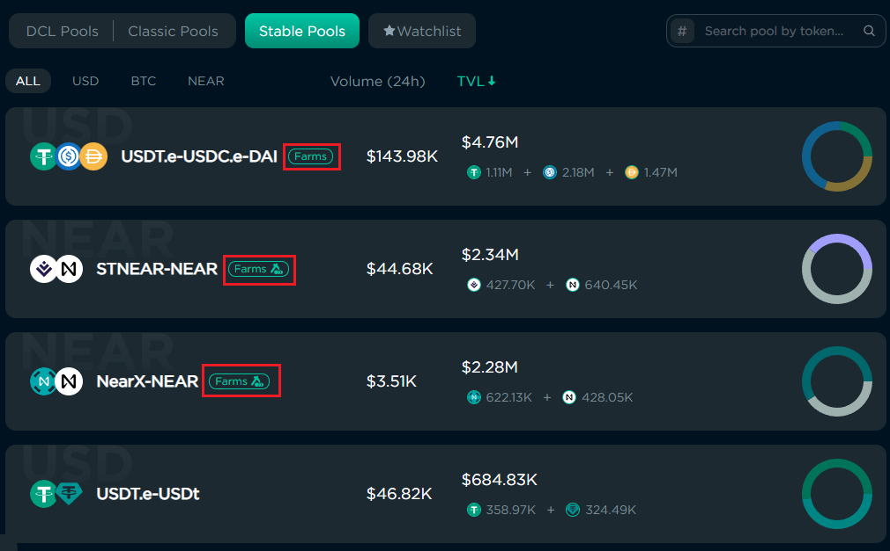<figcaption>
The USDT.e-USDC.e-DAI pool has a farm with one reward token. The STNEAR-NEAR and NEARX-NEAR Rated pools each have farms with multiple reward tokens. The USDT.e-USDt pool does not have a farm.
</figcaption></figure>

### 3. Open the page for the Stable or Rated pool&#x20;

Clicking on a Stable or Rated pool on the Pools page will open a page with tabs to Add or Remove liquidity

<figure>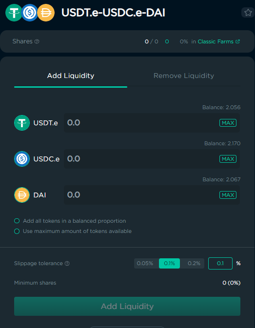<figcaption></figcaption></figure>

### 4. Enter the amounts to deposit

You have three choices when adding liquidity to a Stable or Rated pool. You can deposit any amount of one or more of the pool tokens, deposit amounts that are in the same proportion as the current balance of the pool, or deposit all the tokens in your wallet for that pool.&#x20;

<figure>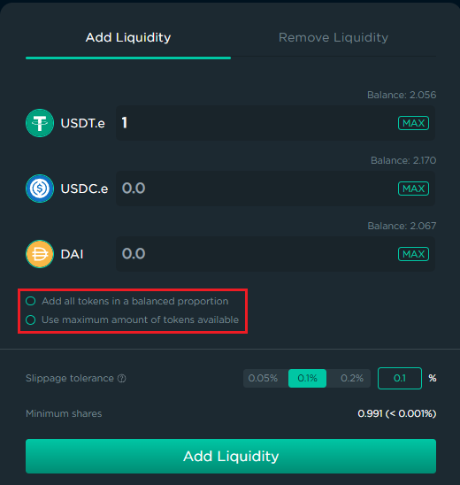<figcaption>
To deposit an arbitrary amount of one or more tokens, no option should be selected.
</figcaption></figure>

 

<figure>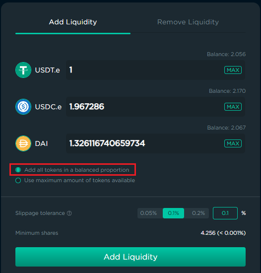<figcaption>
Depositing all tokens in a balanced proportion.
</figcaption></figure>

 

<figure>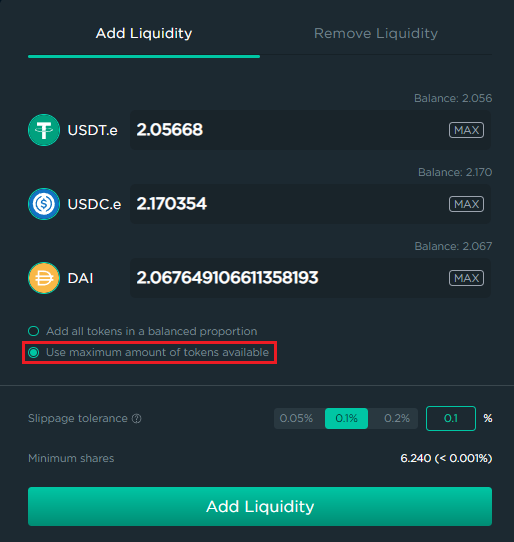<figcaption>
Depositing all relevant tokens in a wallet for a Stable Pool.
</figcaption></figure>

Once you have entered the amounts you wish to add, click "Add Liquidity" to deposit the tokens. You will need to approve the transaction(s) on your wallet for the deposit to be made.&#x20;

## How to remove liquidity from a Stable or Rated pool

### 1. Go to the Your Liquidity page

You can see all pools you have liquidity in by going to the Your Liquidity page. You can get to the Your Liquidity page by clicking Earn > Your Liquidity in the main menu of the site.&#x20;

<figure><figcaption></figcaption></figure>

### 2. Unstake shares from a farm, if necessary

If your shares are staked on a farm you must unstake them before you can remove your liquidity from the pool. If only some shares are staked, you will be able to remove the liquidity for the unstaked portion. See [Farming](../farming.md) for more details about staking and unstaking shares.

<figure>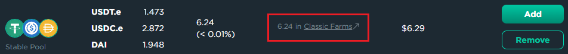<figcaption>
Pool shares are currently staked on a Farm and must be unstaked in order to remove tokens from the pool.
</figcaption></figure>

<figure>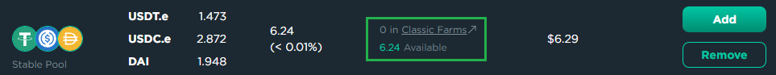<figcaption>
No pool shares are staked on a Farm, allowing the liquidity for all the user's shares to be removed from the pool.
</figcaption></figure>

### 3. Use the Remove Liquidity tab on the Stable or Rated pool

Clicking the Remove button on a Stable or Rated pool will take you to the Remove Liquidity tab on the pool's page.&#x20;

You have the option to remove your liquidity by Share, or by Token. If you remove by Share, you will get back amounts of all the tokens in the pool, proportional to the current balance of those tokens within the pool. If you remove by Token, you decide which tokens you will receive and at what amounts. The current balance of the tokens in the pool will determine how many shares the amounts you entered are worth.

<figure>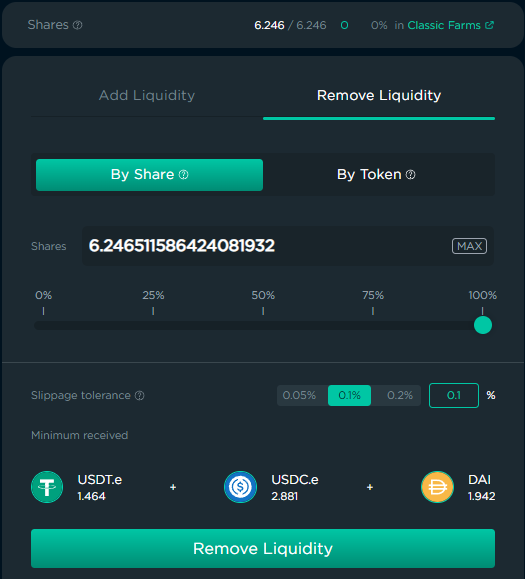<figcaption>
Removing tokens from a Stable pool by shares.
</figcaption></figure>

 

<figure>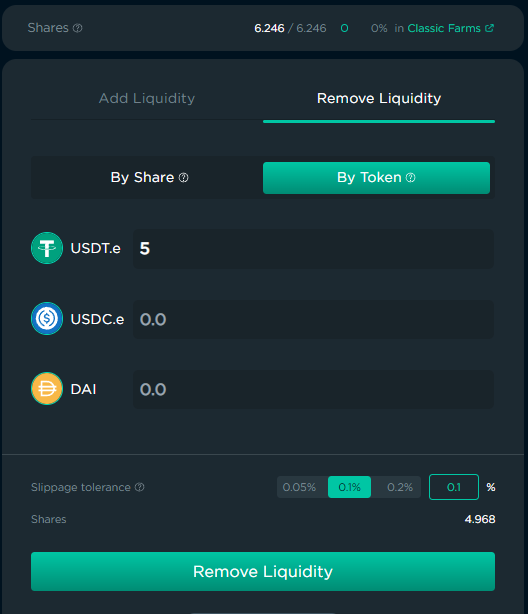<figcaption>
Removing liquidity from a Stable pool by Token. 5 USDT.e is worth 4.968 out of 6.246 shares
</figcaption></figure>

Increase the Slippage Tolerance If you receive slippage related errors when attempting to remove liquidity from a pool. This may be necessary if there are a lot of swaps occurring on the pool at that time, especially if the pool does not have a lot of liquidity in it.
