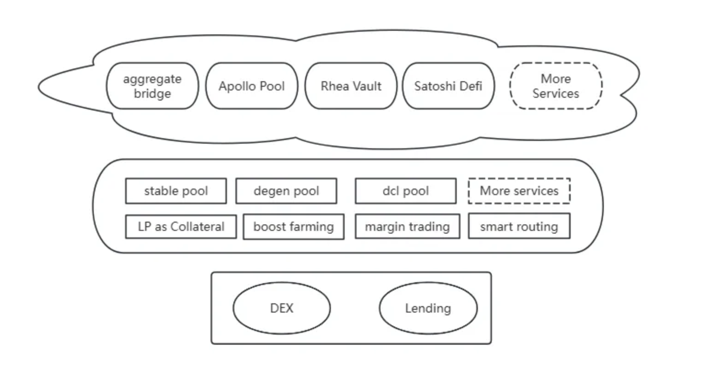

# Trading

The Lite and Pro tabs are two versions available for trading one token for another. The Lite version offers a user-friendly swap interface where you can select the two tokens you wish to exchange and click the swap button. On the other hand, the Pro version provides additional advanced functions to assist you with more comprehensive trade signals.

<figure><figcaption>
Pro Version
</figcaption></figure>

<figure><figcaption>
Lite Version
</figcaption></figure>

The liquidity on Ref Finance is provided by Liquidity Providers (LPs) who stake their tokens in the associated 'Pools'. In return, they receive LP (Liquidity Provider) tokens, which can be staked to earn REF and other tokens in the 'Farms'.&#x20;

When you trade (swap) on Ref Finance, you will pay the pool fee (trading fee), which is broken down as follows:

.jpg>)

For traders, the fee is always taken on the amount paid. The Protocol and Referral fees translate into LP tokens.


For regular pools (Swap function), if there is no account to receive the Referral Fee, it goes to all LPs of that pool as a form of increased LP tokens.

For stablecoin pools (StableSwap function), if there is no account to receive the Referral Fee, it goes to the Protocol Fee as a form of increased LP tokens.

To learn more about this subject, click the link for additional details: [https://gov.ref.finance/t/contract-upgrade-1-7-0-referral-fee/823](https://gov.ref.finance/t/contract-upgrade-1-7-0-referral-fee/823) \



## To start trading on the Lite version:

Make sure you are connected to Ref Finance with your wallet.

### Step 1: Select the pair you want to swap, such as NEAR to DAI.

<figure><figcaption></figcaption></figure>

### Step 2: Review and adjust your Transaction Settings if necessary.

<figure><figcaption></figcaption></figure>

### Step 3: Enter the amount you want to swap.

<figure><figcaption></figcaption></figure>

### Step 4: Click on Details and verify the transaction elements.

<figure><figcaption></figcaption></figure>

### Step 5: Initiate the swap.

<figure><figcaption></figcaption></figure>

### Step 6: Approve the transaction (i.e. using NEAR wallet).

## To start trading on the Pro version:

Unlike the Lite version, the Pro version offers more advanced features to support users in researching information about each token, including:

* A history price chart.
* Multiple trading routes for each pair (if available).
* Cross-chain swap support.

Now let's connect your wallet and start the journey with us.

### Step 1: Select the token pair you wish to swap.

<figure><figcaption></figcaption></figure>

### Step 2: Review and adjust your Transaction Settings if necessary.

If you want to trade cross-chain, remember to enable the cross-chain options.

<figure><figcaption>
Turn on the Cross-chain Options in setting tab
</figcaption></figure>

### Step 3: Enter the desired amount you wish to swap and choose a trading route.

<figure><figcaption></figcaption></figure>

<figure><figcaption>
By default, the route of best price is chosen and you are free to choose another route you like(if there are more).
</figcaption></figure>

<figure><figcaption>
If you choose the Orderly route, please proceed to Orderbook page to place the order. Also, the Orderly price is for reference only and the final price of the transaction will be determined by the execution price of your order.
</figcaption></figure>

### Step 4: Initiate the swap.

<figure><figcaption></figcaption></figure>

### Step 5: Approve the transaction (i.e. using NEAR wallet).

Enjoy your trading experience!
