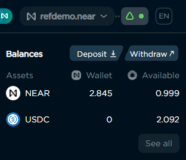
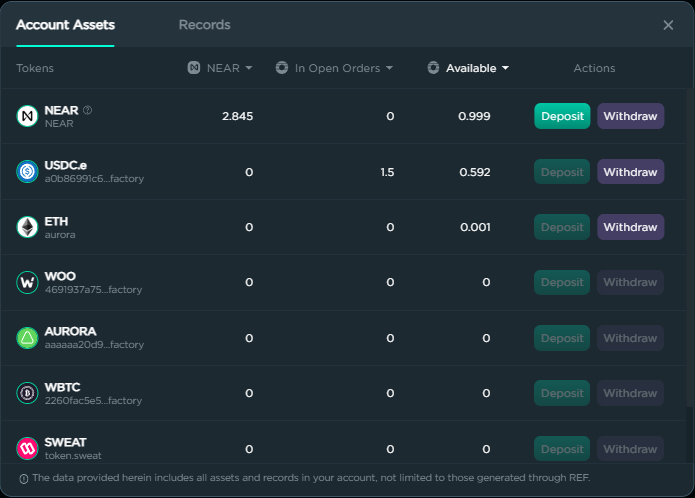
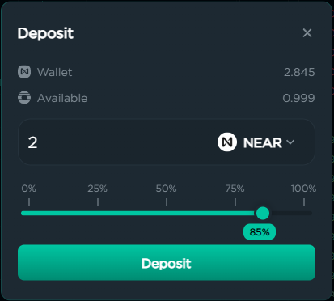
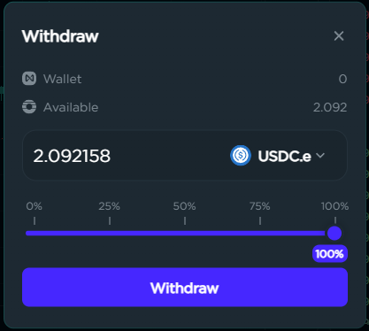
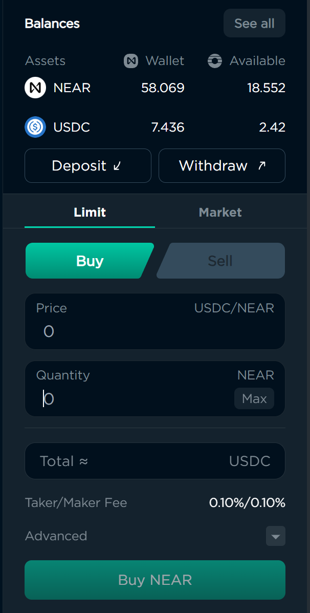

# Spot

## How to trade spot

### Depositing & Withdrawing Tokens

Any token you wish to sell, or use to buy another token, must first be deposited into your Orderly account. This can be achieved by clicking the Deposit or Withdraw buttons in the panel located in the upper-right corner of the Spot page.

<figure><figcaption>
Closeup showing token balances, and Deposit/Withdraw buttons. 
</figcaption></figure>

Along with the Deposit and Withdraw buttons, the panel shows the amounts for the tokens of the selected trading pair that are in your Near wallet and Orderly account. Clicking the “See all” button will open a window showing the balances for all tokens capable of being traded on Orderly.

<figure><figcaption>
Account balance for all tokens that can be traded on the Orderbook.
</figcaption></figure>

Clicking the Deposit or Withdraw button will open a form that allows you to perform that particular action. Each form allows you to select the token you wish to deposit or withdraw, and the amount as a number or percentage.

<figure><figcaption>
Deposit token form.
</figcaption></figure>

 

<figure><figcaption>
Withdraw token form.
</figcaption></figure>

### Placing Orders

Any token you wish to sell, or use for a Buy order, must first be deposited into your Orderly account. Please see [Depositing & Withdrawing Tokens](spot.md#depositing-and-withdrawing-tokens) for more information.

The far right of the Orderbook page contains the panel that allows you to place an order to buy or sell the currently selected token. There are two types of orders that you can place, Limit and Market.

<figure><figcaption>
Token balances and order form.
</figcaption></figure>

#### Limit Orders

A Limit Order is an order to buy or sell at a specific price, or better. Limit orders are not guaranteed to execute. When there are tokens available at the order’s price, the order will be executed. If the amount available at that price is less than the total quantity set for the order, then the order will be partially executed. The unfilled portion of the order will remain open, until such time that more tokens become available at the specified price, or you cancel the order. When a partially filled order is cancelled, only the unfilled amount will be returned to your Orderly account.

To place a Limit Order, make sure “Limit” is selected as the Order Type, enter the price at which you want the order to execute, the quantity you wish to buy or sell or the total amount you want to buy or sell, and click the Buy/Sell button at the bottom of the panel. Clicking a row on the Order Book will set the price of your order to the price of the row you clicked.

<figure><figcaption>
Limit order to buy NEAR
</figcaption></figure>

 

<figure><figcaption>
Limit order to sell NEAR
</figcaption></figure>

#### Market Orders

A Market Order is matched to the best available market price at the time the order is placed, and is immediately executed.

To place a Market Order, choose “Market” as the Order Type, and enter the quantity  you wish to buy or sell or the total amount you want sell or buy.

<figure><figcaption>
Market order to buy NEAR.
</figcaption></figure>

 

<figure><figcaption>
Market order to sell NEAR.
</figcaption></figure>

### Cancelling Orders

The bottom panel allows you to cancel any open orders. If an order has been partially filled, then only the unfilled portion will be cancelled.

<figure><figcaption>
Open orders capable of being cancelled 
</figcaption></figure>
