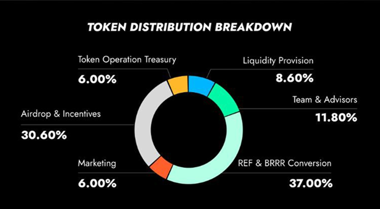

# RHEA Tokenomics

## RHEA – The Core Asset

$RHEA is the foundational utility and governance token of the RHEA ecosystem.

All value accrual mechanisms, fees, and growth are ultimately directed to $RHEA holders.

**Key Roles:**

* Base asset for staking and liquidity provision across the RHEA ecosystem
* Primary conversion target for oRHEA incentives
* Captures value from lending, trading, and treasury flows

## **General Information**

* Token name: RHEA
* Ticker: RHEA
* Fungible Token Contract:&#x20;
  * On NEAR Chain: token.rhealab.near&#x20;
  * On BNB Chain: 0x4c067de26475e1cefee8b8d1f6e2266b33a2372e
* Fixed Supply: 1,000,000,00Ω

## **Token Distribution Breakdown**

<figure><figcaption></figcaption></figure>

<table><thead><tr><th width="261.2851934609063">Categories</th><th width="150">Allocation</th></tr></thead><tbody><tr><td>Team &#x26; Advisors</td><td>11.80%</td></tr><tr><td>REF and BRRR Conversion</td><td>37.00%</td></tr><tr><td>Airdrop and Incentives</td><td>30.60%</td></tr><tr><td>Liquidity Provision</td><td>8.60%</td></tr><tr><td>Marketing</td><td>6.00%</td></tr><tr><td>Token Operation Treasury</td><td>6.00%</td></tr><tr><td>Total</td><td>100.00%</td></tr></tbody></table>

## **Allocation Vesting Schedule**

The RHEA core team has committed to a **long-term vesting structure**, re-locking their previously vested token allocation. These tokens are subject to a **6-month cliff**, followed by **30 months of linear vesting**, with **zero tokens unlocked at launch**.

This ensures full alignment with the protocol’s long-term success and community interests.

* **No insider liquidity at TGE**
* **Strengthens protocol credibility and investor trust**
* **Signals strong, long-term commitment from the core team**

<figure><figcaption>
Vesting schedule up to 36 months
</figcaption></figure>

## Token Utility&#x20;

### The $RHEA Token Stack: Three Tokens, One Ecosystem 

To meet the diverse needs of protocol growth, user rewards, and governance, RHEA operates on a **three-token structure**:

### 1. RHEA — The Core Asset 

$RHEA is the foundational utility and governance token of the RHEA ecosystem.

All value accrual mechanisms, fees, and growth are ultimately directed to $RHEA holders.

**Key Roles:**

* Base asset for staking and liquidity provision across the RHEA ecosystem
* Primary conversion target for oRHEA incentives
* Captures value from lending, trading, and treasury flows

### 2. xRHEA — Staked, Escrowed 

xRHEA represents **staked RHEA** and unlocks advanced features and deeper utility across the protocol.

It is **non-transferable** and acts as a signal of long-term commitment to RHEA.

**xRHEA Utility:**

* Earns staking incentives in the form of oRHEA
* Used as gas within the RHEA ecosystem
* Boosts yield multiplier when staked
* Can be supplied as collateral in RHEA’s lending markets and partner protocols
* Determines **on-chain reputation and conversion multiplier** for oRHEA → RHEA

### 3. oRHEA — The Reputation-Weighted Incentive Token 

oRHEA is a **non-transferable, reputation-based incentive token** earned through active participation:

* Generated through activities across the RHEA ecosystem, including Liquidity Provision and lending (with varying weights)
* Distributed via campaigns and partner integrations

**Conversion Mechanics:**

* Convertible to RHEA
* Conversion ratio is based on **on-chain reputation**, determined by a user’s xRHEA balance and holding duration
* Max ratio: **1 oRHEA : 1 RHEA**
* Distributed on a **seasonal basis** from a fixed emissions pool

oRHEA replaces traditional point systems and serves as the **core of long-term incentivization** across the ecosystem.

## Summary of Token Utility

<table><thead><tr><th width="260.0078125">Use Case</th><th>RHEA</th><th>XRHEA</th><th>oRHEA</th></tr></thead><tbody><tr><td>Staking </td><td>✅</td><td>✅</td><td>—</td></tr><tr><td>Protocol Fee Sharing </td><td>—</td><td>✅</td><td>✅</td></tr><tr><td>On-Chain Reputation</td><td>—</td><td>✅</td><td>✅</td></tr><tr><td>Conversion Mechanism</td><td>—</td><td>—</td><td>✅ → RHEA</td></tr><tr><td>Gas Within RHEA Ecosystem</td><td>—</td><td>✅</td><td>—</td></tr><tr><td>Yield Boosting / Collateral Use</td><td>—</td><td>✅</td><td>—</td></tr><tr><td>Earned via Activity</td><td>—</td><td>—</td><td>✅</td></tr></tbody></table>

