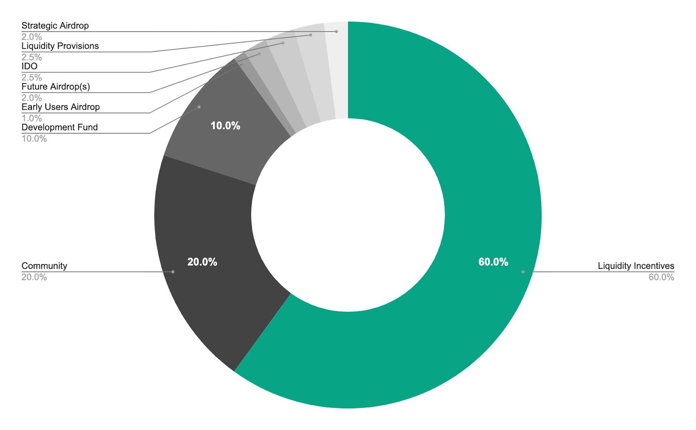

# Tokenomics

## **General Information**

REF **** is a Governance token that also rewards its holders with a protocol revenue sharing model.

* Token name: Ref Finance
* Ticker: REF
* Fungible Token Contract: token.v2.ref-finance.near
* Fungible Token Standard: NEP-141
* Fixed Supply: 100,000,000
* IDO: 2,500,000 auctioned via Skyward Finance (July 26–31, 2021)

## **Token Allocation**

****

| Categories                     | Allocation | Release Schedule                                                            |
| ------------------------------ | ---------- | --------------------------------------------------------------------------- |
| Liquidity Incentives           | 60%        | 
Year 1: 25%

Year 2: 18.3%

Year 3: 11.7%

Year 4: 5%
 |
| Community Contributions        | 20%        | N/A                                                                         |
| Development Fund               | 10%        | 4-year linear release                                                       |
| Early Users Airdrop            | 1%         | 3-month vesting with 3-month cliff                                          |
| Future Airdrop(s)              | 2%         | TBD                                                                         |
| IDO (Skyward Auction)          | 2.5%       | 1-week auction                                                              |
| REF Token Liquidity Provisions | 2.5%       | N/A                                                                         |
| Strategic Airdrop              | 2%         | N/A                                                                         |

## **Private Fundraising**

In March 2022, Ref Finance has closed a strategic Over-the-Counter (OTC) deal with professional investors as well as business angels.

Professional investors are:

* [Jump Crypto](https://jumpcrypto.com) (Lead)
* [Alameda Research](https://www.alameda-research.com)
* [Dragonfly Capital](https://www.dcp.capital)
* [D1 Ventures](https://www.d1.ventures)
* [OKX BlockDream Ventures](https://www.okx.com/blockdream-ventures)
* [Kucoin Ventures](https://www.kucoin.com/land/kucoinlabs)
* [SevenX Ventures](http://www.7xvc.com)
* [Woo Network](https://woo.org)
* [Move Capital](https://move-capital.com/en/)
* [Puzzle Ventures](https://puzzle.ventures)

The objective of the fundraising is to support **** and cover the development cost of the solution for at least 24 months, starting from March 2022.

The total amount raised was $4.5m in stablecoins in exchange for 3,664,943 REF tokens, leading to an average price of 1.227 REF per stable.

The stablecoins breakdown is as follows:

* $3.6m USDC
* $0.9m USDT

### Terms

* Price: 7-day market Time-weighted Average Price (TWAP) at a 20% discount
* Lockup: 1-year linear release every quarter

More details can be found in the [Ref governance forum](https://gov.ref.finance/t/a-strategic-ref-otc-wip/448).

## **Token Utility**

1. **Earning protocol revenue**: Users who stake REF tokens to earn fees generated by the protocol
2. **Pooling**: Users who provide liquidity with any REF token pairs earn swap fee from the associated pool(s)
3. **Farming**: Users who stake their LP tokens into different farms, thus earning additional revenue
4. **Governance** (Under Development): Users who stake xREF to participate in the governance and vote on key proposals

