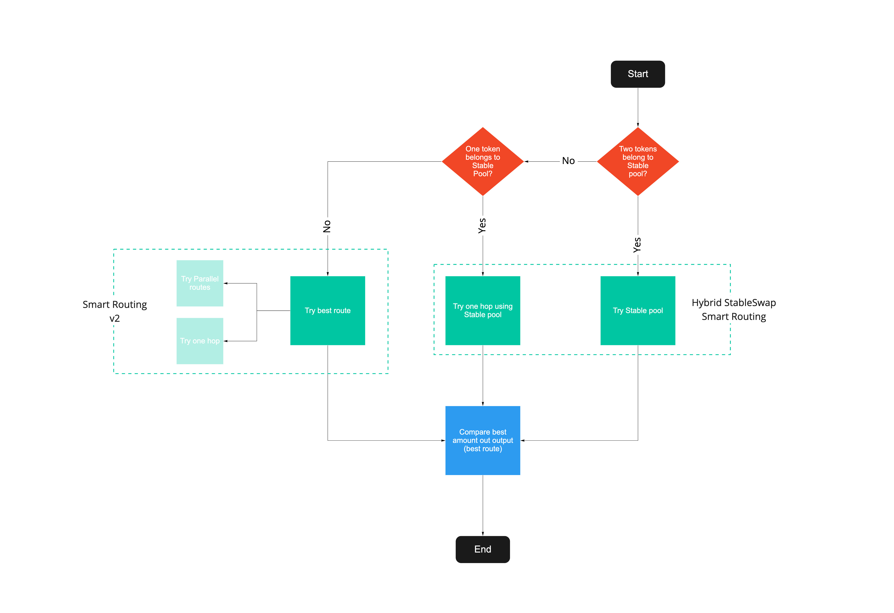

# Auto Router

Auto Router, also known as Smart Routing, can be defined as the ability to find better prices for traders on RHEA Finance. This includes splitting the trade across multiple pools at once.

The Auto Router delivers a unique value proposition. Value that will be accumulated over time by Ref's users, in the form of better prices and liquidity utilisation.


The Auto Router algorithm is open source, and available at the frontend/interface level of RHEA Finance


## High-Level Design&#x20;

RHEA Finance's Auto Router aims to find the best price for a trade. The algorithm takes advantage of all liquidity, using, when available:

1. Parallel pools
2. Intermediary pools

In a nutshell, the solution determines the best **allocation** across pools of the same pairs, and the best **path** using one hop or intermediary pool.


The Auto Router also leverages the [StableSwap function](../../near-chain-guides/how-rhea-finance-works/), therefore combining both, normal and stable pools as potential intermediary pools


Find below a high-level description of the Auto Router.

The Auto Router ultimately creates a win-win situation for market participants:

* Traders: better prices
* Liquidity Providers: fairer model (vs winner-takes-all approach)

For more details, please refer to:

* Parallel Swap solution: [https://github.com/giddyphysicist/ParallelSwapForRefFinance](https://github.com/giddyphysicist/ParallelSwapForRefFinance)
* Parallel Swap Liquidity Threshold Research Paper



* Smart Routing Multi Swap Optimization Research Paper



* Smart Routing Test Plan



## **Credit** 

The Auto Router is the result of a successful collaboration between the team and Giddy & Dave.

Giddy is an avid learner of Web3 and DeFi. His background in mathematical modeling is aided by his experience with a doctorate in physics, and he likes to explore complex systems with the tools of modeling & simulation, algorithm development, and data analysis. He posts most of his work to [https://github.com/giddyphysicist](https://github.com/giddyphysicist).

Dave is a DeFi enthusiast. He is also very interested in math, problem solving, and coding. His entrance into the DeFi world was solving some difficult optimization problems. He has three Master’s degrees, including physics and analytics.

Giddy & Dave won Ref's first Hackathon ([OpenDeFi Hackathon 3](https://github.com/near/bounties/issues/64)). The implementation of the Parallel Swap and Smart Routing followed their original winning [submission](https://github.com/giddyphysicist/ParallelSwapForRefFinance).&#x20;

Giddy & Dave are the creators and authors of the associated research papers (see above).
