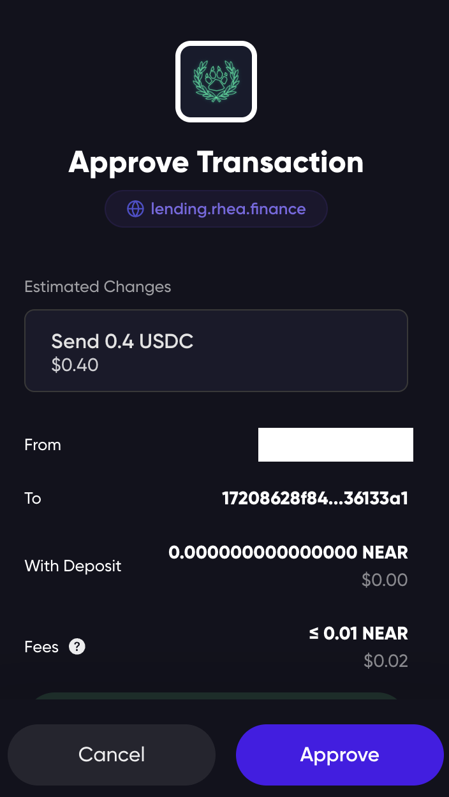

# Step by Step Guide

## Supply

Step 1: Access [https://lending.rhea.finance/](https://lending.rhea.finance/) and connect your wallet

<figure><figcaption></figcaption></figure>

Step 2: Select one asset from the list and click “Supply”

<figure><figcaption></figcaption></figure>

Step 3: Enter your desired number and turn on “Use as Collateral” (Optional)

<figure><figcaption></figcaption></figure>

Step 4: Supply and sign the transaction

<figure><figcaption></figcaption></figure>

## Borrow

Make sure you have already supplied your asset (and turned on Use as collateral button) first before borrowing.

<figure><figcaption></figcaption></figure>

Step 1: Select a token you want to borrow

I will borrow $DAI using $USDT as collateral in this situation

<figure><figcaption></figcaption></figure>

Step 2: Choose an appropriate amount

<figure><figcaption></figcaption></figure>

Step 3: Verify all the details and confirm the transaction

### Repay

Step 1: Click on Repay Button

<figure><figcaption></figcaption></figure>

Step 2: Enter an appropriate amount&#x20;

<figure><figcaption></figcaption></figure>

Notice that Health Factor changes every time you increase/decrease the repayment amount

Step 3: Confirm the transaction

### Withdraw

Step 1: Click the [Dashboard](https://lending.rhea.finance/dashboard) button & choose the token you wish to withdraw

<figure><figcaption></figcaption></figure>

Step 2:  Choose an appropriate amount

<figure><figcaption></figcaption></figure>

Step 3: Verify the details and confirm your transaction

### Adjusting collateral

Step 1: Select the token and click "Adjust" button

<figure><figcaption></figcaption></figure>

Step 2: Enter an appropriate amount&#x20;

Keep an eye on your Health Factor since it will adjust following your collateral position

<figure><figcaption></figcaption></figure>

Step 3: Confirm the transaction
